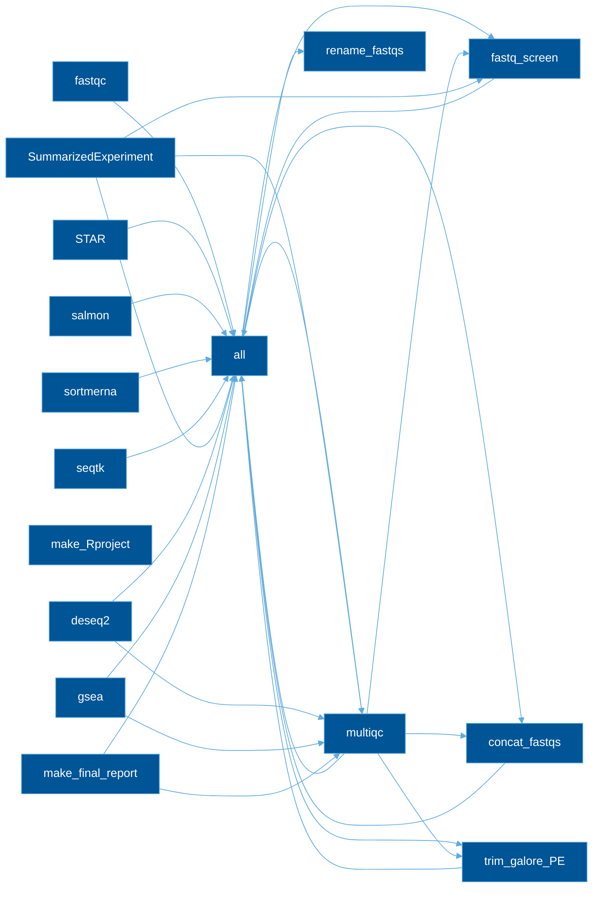

# Bulk RNAseq Workflow


* [Bulk RNAseq Workflow](#bulk-rnaseq-workflow)
   * [Usage](#usage)
      * [Step 1: Configure the workflow](#step-1-configure-the-workflow)
      * [Step 1b (<em>optional</em>): Specify contig groups for variant calling](#step-1b-optional-specify-contig-groups-for-variant-calling)
      * [Step 2: Test and run the workflow](#step-2-test-and-run-the-workflow)

## Usage

**NOTE** this workflow is optimized for the HPC @ Van Andel Institute.


### Step 1: Configure the workflow
* Move your sequencing reads to `raw_data/`

* Modify the config, comparisons, and samplesheet:
  * config/samplesheet/units.tsv; To make a template based in the files in `raw_data/`, run `./make_units_template.sh`.
    * **sample**        - ID of biological sample; Must be unique.
    * **group**         - Experimental group 
    * **fq1**           - name of read1 fastq
    * **fq2**           - name of read2 fastq
    * **RG**            - space-delimited read group specification e.g. ID:XYZ PU:XYZ LB:LIB01 PL:ILLUMINA SM:SAMPLE01

  * config/samplesheet/comparisons.tsv; fill this out with you 
    * **comparison_name**    - Name of your comparison (use only letters, numbers, and underscores -- special characters or spaces will result in errors).
    * **group_test**         - Experimental group (treated/condition/phenotype)
    * **group_reference**    - Reference group (control/wildtype/baseline)

  * config/config.yaml

### Step 1b (_optional_): Specify contig groups for variant calling

Certain parts of the variant calling will parallelize by splitting by contig. The non-standard chromosomes can be grouped together since they are usually very small. The contig groupings are specified by the file `config/grouped_contigs.tsv`; column 1 is the name for the group of contigs and column 2 is a comma-separated list of the contigs.

```
cd config
module load bbc2/R/alt/R-4.2.1-setR_LIBS_USER
Rscript --vanilla group_chroms.R 
```

### Step 2: Test and run the workflow
Test your configuration by performing a dry-run via

```
snakemake -npr
```

Execute from within your project directory as a SLURM job.

```
sbatch bin/run_snake.sh
```
### DAG of the Pipeline

